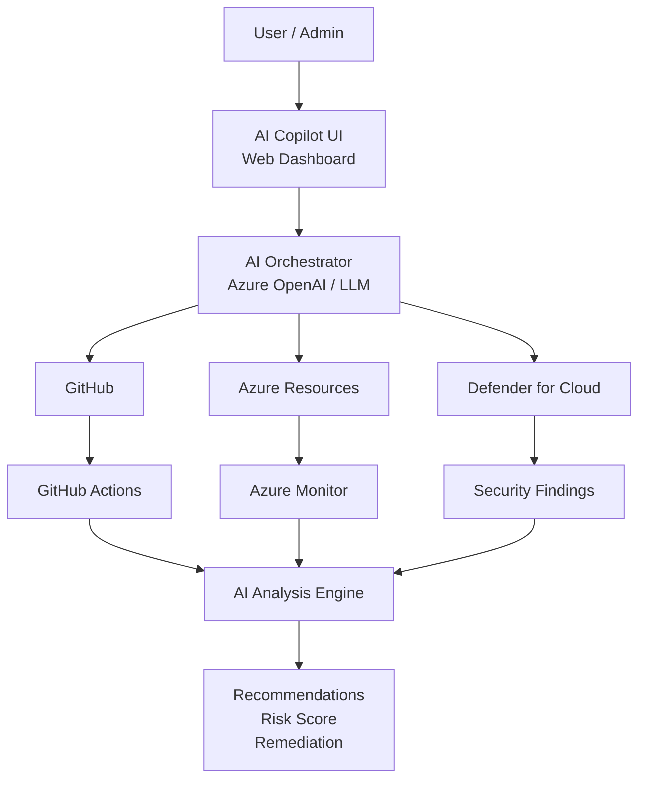

# AI DevSecOps Copilot

This project is a complete, runnable prototype for an AI-powered DevSecOps Copilot that centralizes GitHub, Azure, and Microsoft Defender telemetry into a single operational dashboard.

## Recommended architecture



## Features

- Unified security and operations dashboard
- AI-driven recommendations for risk and remediation
- Connector status for GitHub, Azure, and Defender
- Cost, performance, and reliability score tracking
- Responsive UI for operators and admins

## Run locally

```bash
npm install
npm start
```

Then open http://localhost:3000

## API

- GET /api/health
- GET /api/overview
- GET /api/recommendations
- GET /api/architecture

## Stack

- Node.js + Express
- Vanilla HTML/CSS/JavaScript frontend
- Simulated AI orchestrator and telemetry layer

## Notes

This is designed as a production-style prototype and uses realistic mock data so it can run without cloud credentials.
